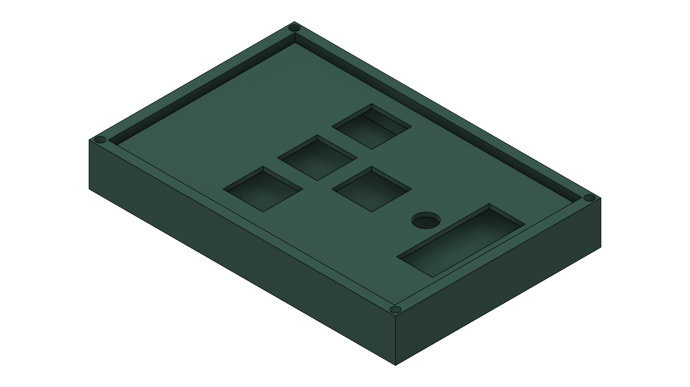
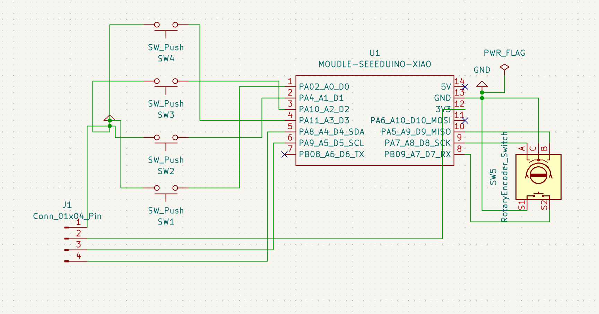
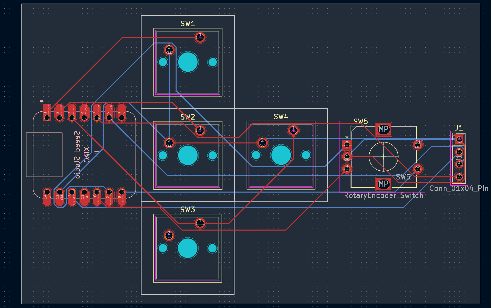
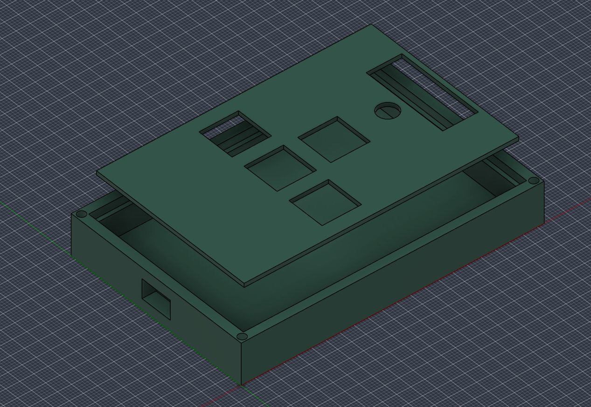

# Artem's Hackpad

A custom 4-key macropad with a rotary encoder and an I2C 0.91" OLED display powered by a Seeed Studio XIAO RP2040 and QMK firmware.

## Overview

## Schematic

## PCB Layout

## Case & Assembly

## Bill of Materials (BOM)
| Component | Quantity | Description |
| :--- | :--- | :--- |
| Seeed Studio XIAO RP2040 | 1 | Microcontroller |
| Cherry MX Compatible Switches | 4 | Mechanical switches |
| Keycaps | 4 | 1U Keycaps |
| EC11 Rotary Encoder | 1 | Encoder with push switch |
| 0.91" I2C OLED Screen | 1 | 128x32 display (GP6/GP7) |
| 4-pin 2.54mm Header | 1 | OLED connector socket |
| 3D Printed Case & Plate | 1 | PLA/PETG |
| Screws / Hardware | 4 | M2 or M3 plate mounting screws |