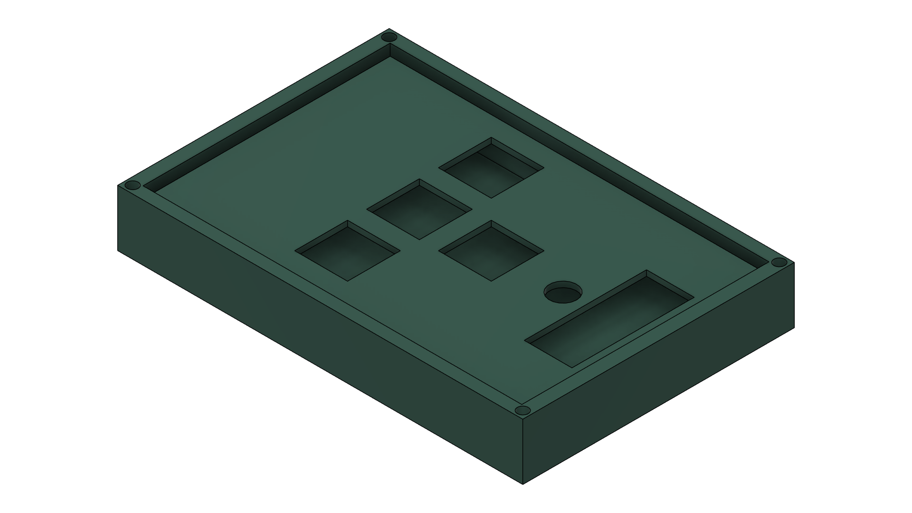
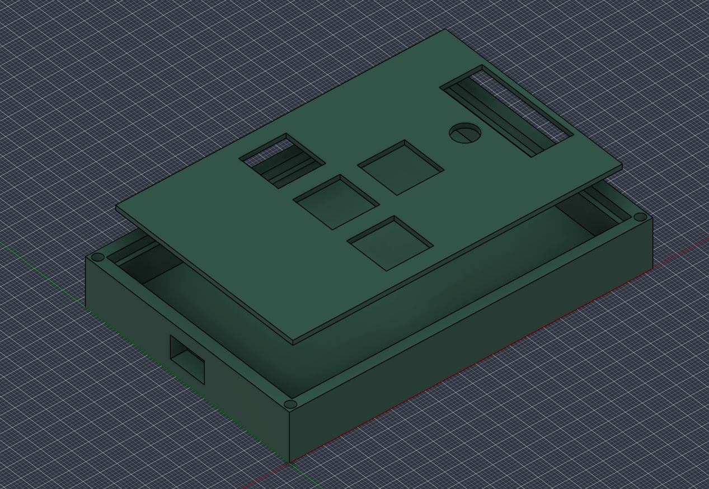
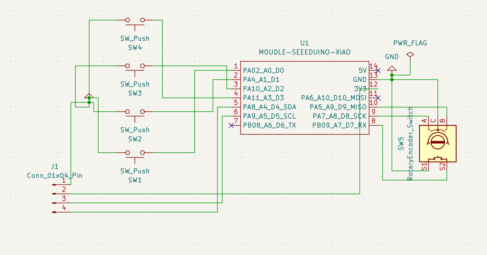
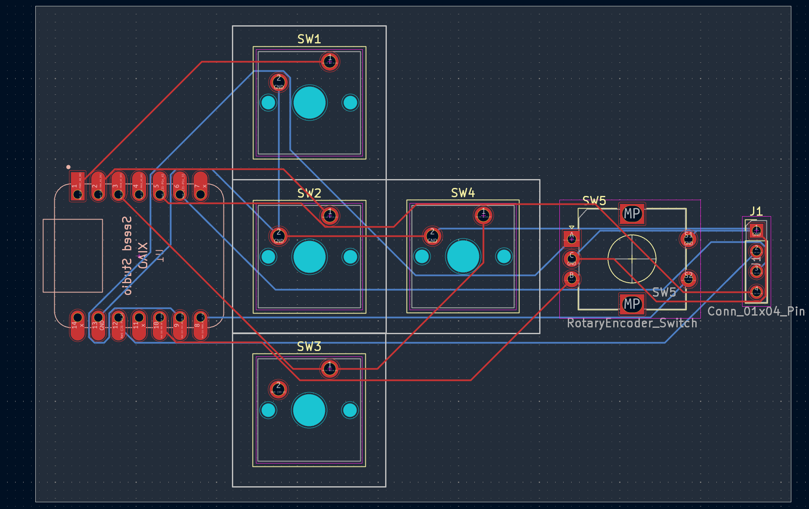

# PrasinoPad
###### $${\color{gray}\text{Prasino: Prasinos = Green (from greek language)}}$$

Customizable 4-key macropad with the Seeed Studio XIAO RP2040 microcontroller along with Cherry MX switches, an EC11 rotary encoder, and a 0.91" I2C OLED display, which is controlled by QMK firmware.

Depending on whether one needs a media controller, scrubbing for video editing, or simply some hotkeys for application control, PrasinoPad provides the possibility to have everything at hands without unnecessary desk cluttering.

---

## Features

* **Direct-Pin Switching**: As there are only 4 keys, each switch is connected directly to the GPIO pin of the MCU pulled to the ground, eliminating the need for any diode matrix.
* **Rotation Knob**: Alps/EC11 rotary encoder for controlling volume, scrolling, or scrubbing along the timeline, featuring a built-in tactile switch.
* **Status Indicators**: 0.91" 128x32 OLED display over I2C to display active layers, volume level, or status icons.
* **Sleek Microcontroller**: Equipped with the Seeed Studio XIAO RP2040, mounted directly on the underside of the board to keep the desk footprint small.
* **Personalized Shell**: 3D-printed body with special slots for the switch plate, knob, and OLED display.

---

## Hardware Gallery

### Assembled Render

### 3D Printed Enclosure

### KiCad Schematic

### PCB Layout

---

## Pinout & Wiring

The XIAO RP2040 is soldered to the bottom layer (`B.Cu`) with direct access to all the board components:

| Component | Function | XIAO Pin (KiCad Net) | RP2040 GPIO | Description |
| :--- | :--- | :--- | :--- | :--- |
| **SW1** | Key 1 | `D0` (`PA02_A0_D0`) | GP26 | Pulled low to GND on press |
| **SW2** | Key 2 | `D1` (`PA4_A1_D1`) | GP27 | Pulled low to GND on press |
| **SW3** | Key 3 | `D2` (`PA10_A2_D2`) | GP28 | Pulled low to GND on press |
| **SW4** | Key 4 | `D3` (`PA11_A3_D3`) | GP29 | Pulled low to GND on press |
| **SW5 (Enc)** | Channel A | `D8` (`PA7_A8_D8_SCK`) | GP4 | Encoder quadrature signal A |
| **SW5 (Enc)** | Channel B | `D9` (`PA5_A9_D9_MISO`) | GP3 | Encoder quadrature signal B |
| **SW5 (Switch)**| Encoder Push| `D7` (`PB09_A7_D7_RX`) | GP1 | Pulled low to GND on click |
| **OLED (J1 Pin 4)**| I2C SDA | `D4` (`PA8_A4_D4_SDA`) | GP6 | Serial Data line |
| **OLED (J1 Pin 3)**| I2C SCL | `D5` (`PA9_A5_D5_SCL`) | GP7 | Serial Clock line |
| **OLED (J1 Pin 2)**| Power | `3V3` | 3.3V Rail | Logic power |
| **OLED (J1 Pin 1)**| Ground | `GND` | Ground | Common system ground |

---

## Bill of Materials (BOM)

| Item | Qty | Details | Footprint / Notes |
| :--- | :--- | :--- | :--- |
| **Seeed Studio XIAO RP2040** | 1 | RP2040 microcontroller development board | Hybrid SMD / THT footprint on PCB rear |
| **Cherry MX Switches** | 4 | Standard mechanical keyswitches | 1.00u PCB mount footprint |
| **1U Keycaps** | 4 | Standard profile keycaps (OEM / Cherry / XDA) | Fits standard MX stem |
| **EC11 Rotary Encoder** | 1 | Incremental encoder with tactile push switch | Alps EC12E vertical footprint |
| **0.91" OLED Display** | 1 | 128x32 monochrome I2C display | 4-pin interface |
| **Female Pin Header** | 1 | 1x4 2.54mm pitch female header | Socket for the OLED screen |
| **3D Printed Case & Plate** | 1 | Printed housing (PLA or PETG) | Case STL files |
| **Hardware** | 4 | M2 or M3 screws | Secures the plate to the case |

---

## Firmware Configuration

PrasinoPad employs Direct-pin mapping in QMK:

1. **Matrix Mapping**: In your keyboard configuration file, add `DIRECT_PINS` pin mappings for switches with `GP26`, `GP27`, `GP28`, and `GP29`.
2. **Encoders Configuration**: Add `ENCODERS_PAD_A { GP4 }` and `ENCODERS_PAD_B { GP3 }`. The encoder switch will be mapped as a regular key in the direct matrix (`GP1`).
3. **OLED Display**: Add `OLED_ENABLE = yes` and `OLED_DRIVER = SSD1306` in `rules.mk` and configure I2C pins to `GP7` (SCL), `GP6` (SDA).
4. **Programming**:
    * Press the **BOOT** button on the XIAO RP2040 while connecting the USB-C connector.
    * Mount the board as a mass storage device (`RPI-RP2`) and copy your compiled `.uf2` file into that drive.

---

## Assembly Hints

* **Order of Soldering**: First solder the XIAO RP2040 board to the back of the PCB, then the 4-pin OLED header socket, Cherry MX switches and rotary encoder.
* **OLED Positioning**: With a pin header socket used instead of direct soldering of the display you will be able to adjust its position and make sure that it is level with the window of the case.
* **Printing Parameters**: 0.2mm layer thickness, 3-4 perimeters and 20% fill should give enough stiffness for the switch holes and screw holes.
